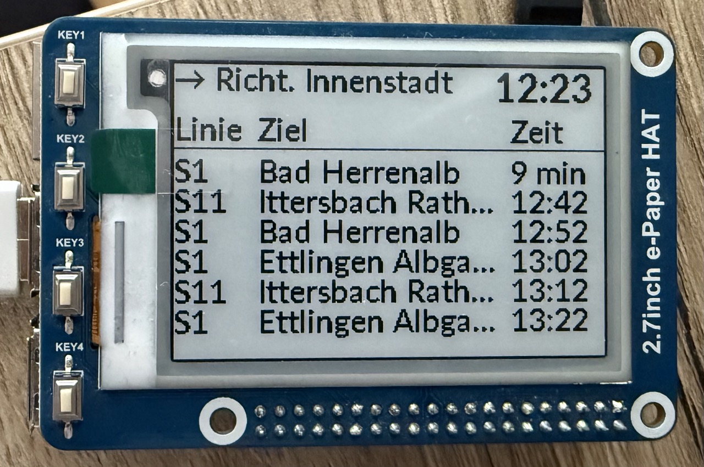
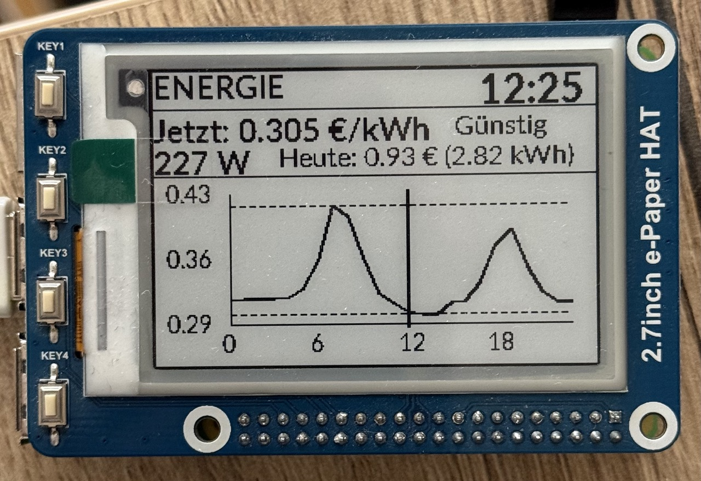

# KVV Transit & Tibber Energy Display

A Raspberry Pi-powered e-ink display showing real-time public transit departures and electricity prices for Karlsruhe, Germany.




## 🌟 Features

- **Real-time KVV Transit Info**: Shows next 6 departures for North/South directions
- **Tibber Energy Monitoring**: Current electricity price with 24-hour price graph
- **3-Button Interface**: Physical buttons to switch between screens
- **E-ink Display**: Low power, always readable 2.7" display
- **German Interface**: All information displayed in German
- **Smart Refresh**: Transit updates every 60s, energy every 5min

## 🖥️ Display Screens

### Transit Screens (North/South)
```
Nord                        14:23
─────────────────────────────────
Linie    Ziel            Zeit
─────────────────────────────────
S1       Ettlingen...    jetzt
S11      Hochstetten     3 min
[... up to 6 departures]
```

### Energy Screen with Price Graph
```
ENERGIE                     14:23
─────────────────────────────────
Jetzt: 0.324 €/kWh    Teuer
176 W | Heute: 1.31 € (4.14 kWh)
─────────────────────────────────
[PRICE GRAPH showing 24h curve]
```

## 🔧 Hardware Requirements

- Raspberry Pi 2 (or newer)
- 2.7" Waveshare e-Paper Display HAT (264×176)
- 3 push buttons connected to GPIO pins 5, 6, and 13
- Internet connection for API access

## 📦 Installation

### 1. System Setup

```bash
# Update system
sudo apt update
sudo apt full-upgrade

# Install dependencies
sudo apt install python3-pip python3-pil python3-spidev \
                 python3-rpi.gpio python3-gpiozero \
                 python3-dateutil fonts-lato -y

# Enable SPI
sudo raspi-config
# Navigate to: Interface Options → SPI → Enable
```

### 2. Clone Repository

```bash
git clone https://github.com/ricbaral/kvv-rpi-display.git
cd kvv-rpi-display
```

### 3. Configuration

#### KVV Transit API

Edit `kvv_api.py`:
```python
STATION_CONFIG = {
    "NORTH": {"id": "7001105", "platform": "1", "name": "Nord"},
    "SOUTH": {"id": "7001105", "platform": "2", "name": "Süd"}
}
```

#### Tibber/Home Assistant

Edit `home_assistant_api.py`:
```python
HOME_ASSISTANT_URL = "http://192.168.178.127:8123"
```

Set environment variable:
```bash
export HA_TOKEN="your_home_assistant_long_lived_token"
```

### 4. Test Installation

```bash
# Test display
sudo python3 app.py

# Test without display
python3 tests/test_home_assistant.py
python3 tests/test_tibber_graph.py
```

### 5. Auto-start on Boot

```bash
# Add to /etc/rc.local before 'exit 0':
su pi -c "cd /home/pi/kvv-rpi-display && python3 app.py &"

# Or use systemd service:
sudo cp kvv-display.service /etc/systemd/system/
sudo systemctl enable kvv-display
sudo systemctl start kvv-display
```

## 🎮 Button Controls

| Button | GPIO Pin | Function | Color |
|--------|----------|----------|-------|
| 1 | GPIO 5 | North Transit | Red |
| 2 | GPIO 6 | South Transit | Yellow |
| 3 | GPIO 13 | Energy Display | Green |

## 📊 Tibber Price Graph Features

- **24-Hour View**: Shows today's hourly electricity prices
- **Current Hour Marker**: Vertical line indicates current time
- **Price Levels**: German indicators (Sehr günstig → Sehr teuer)
- **Tomorrow's Prices**: Dashed line after 1-3 PM (when available)
- **Min/Max Lines**: Dotted horizontal lines at price extremes

## 🔌 API Requirements

### KVV API
- HAFAS-compatible station IDs

### Home Assistant
- Running Home Assistant instance
- Tibber integration configured
- Required entities:
  - `sensor.tibber_priceinfo_raw` (price predictions)
  - `sensor.[location]_strompreis` (current price)
  - `sensor.tibber_pulse_*` (consumption data)

## 🐛 Troubleshooting

| Issue | Solution |
|-------|----------|
| No transit data | Check KVV API token and internet connection |
| No energy data | Verify Home Assistant URL and token |
| Display not updating | Check SPI is enabled, restart service |
| Buttons not working | Test with `tests/button_test.py` |
| Graph not showing | Ensure `sensor.tibber_priceinfo_raw` has data |

## 📁 Project Structure

```
├── app.py                  # Main application
├── display_optimized.py    # E-ink display driver
├── kvv_api.py             # Transit API client
├── home_assistant_api.py  # Tibber data fetcher
├── epd2in7/               # Waveshare drivers
└── tests/                 # Test utilities
```

## 🚀 Development

### Running Tests
```bash
# Test Home Assistant connection
python3 tests/test_home_assistant.py

# Test price graph parsing
python3 tests/test_tibber_graph.py

# Test button GPIO
sudo python3 tests/button_test.py
```

### Key Constraints
- Display: 264×176 pixels, monochrome only
- Refresh: ~2 seconds full screen update
- No emoji: E-ink incompatible
- Memory: Limited on RPi 2

## 📝 License

MIT License - See [LICENSE](LICENSE) file

## 🙏 Credits

- Original transit display by Felix Divo & Jonas Weidmann
- KVV adjustments, Tibber integration, and graph display added by Riccardo Baral
- Waveshare for e-Paper display drivers
- KVV for open transit data
- Tibber for energy data API

## 🔄 Recent Updates

- **v2.0** - Added Tibber price graph with 24-hour view
- **v1.9** - German price level indicators
- **v1.8** - Optimized refresh rates (60s/5min)
- **v1.7** - Increased to 6 departure lines
- **v1.6** - Three-screen system with GPIO buttons

---

*This project displays real-time transit and energy data for daily household use in Karlsruhe, Germany.*
